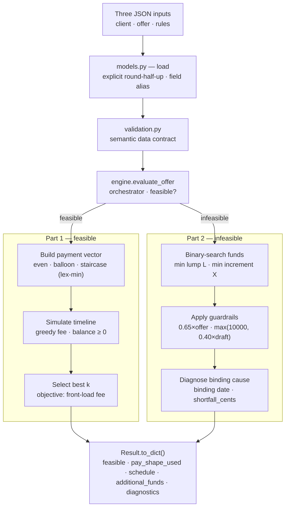
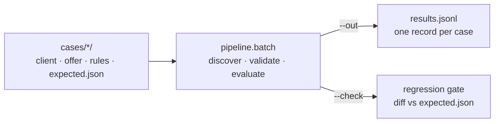

# Architecture

One escrow account is simulated forward in time. Three JSON inputs are loaded,
validated, and handed to `evaluate_offer`, which either returns the best feasible
schedule (Part 1) or the minimum additional funding plus a diagnosis (Part 2).

## How the boxes map to the code

| Box | File / function |
| --- | --- |
| Load + round | `feasibility/models.py` — loaders, `round_half_up`, date helpers |
| Data contract | `feasibility/validation.py` — `validate_inputs` |
| Orchestrator | `feasibility/engine.py` — `evaluate_offer` |
| Build payment vector | `feasibility/solver.py` — `floors_for_k`, `build_even` / `build_balloon` / `build_staircase`, `build_all_vectors` |
| Simulate timeline | `feasibility/solver.py` — `simulate`, `_ledger_flows` |
| Select best k | `feasibility/engine.py` — `_best_schedule`; `feasibility/objectives.py` — the ranking policy |
| Binary-search funds | `feasibility/engine.py` — `_additional_funds`, `_bisect_min` |
| Guardrails | `feasibility/engine.py` — `_additional_funds` (lump and increment caps) |
| Diagnose | `feasibility/engine.py` — `_diagnose` |

## The eval harness around it

`pipeline/batch.py` wraps `evaluate_offer` to treat the engine like a model under
test: it walks a directory of cases, validates and runs each, and emits one JSONL
record per case with the verdict and wall-clock timing. With `--check` it diffs each
output against a committed `expected.json` golden and fails on any drift — the
deterministic-eval / regression pattern.

